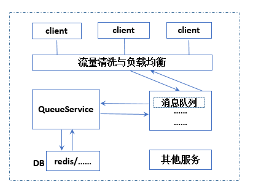
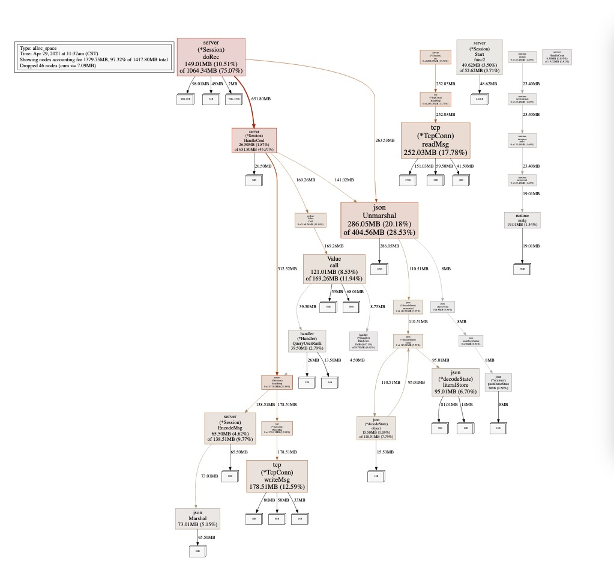

# QueueService

## 功能
    开发开服排队系统，对到达服务器的大量用户进行队列缓冲，名为QueueService，根据服务器压力情况，逐步让队列中的用户拿到登录服务器的令牌（token），代表该用户请求可以被处理了，从而缓解登录高峰，排队中用户要能够“实时”知道自己在队伍中的位置变更。

## 概览
* client 客户端代码
* cmd 消息协议定义
* compress 压缩与解压模块
* config 配置
* conn 连接模块
* handler 逻辑处理代码
* queue 队列模块
* server 服务启动与连接管理
* util 工具

## 实现方案
    客户端通过tcp长链接通信（可替换），初始化日志，启动服务，开启qps协程，开启协程接收链接，收到链接通过channel发送到处理链接协程创建session，管理session，开启协程接收数据，数据通过channel
    发送到消息处理协程，链接开始后，发送第一个包为绑定用户，需要向sdk或者登录服务进行验证（简化了），根据cmd
    反射获取处理函数，并按函数入参进行反序列化数据，处理消息，约定返回结果为错误码，错误信息，需要返回的数据，处理完后，包装消息，发送回客户端。
    
    逻辑流程：
    客户端先到队列服务排队，队列服务管理玩家，其他服务从队列服务消耗玩家时，队列服务通知玩家可登录。
    
    服务器入口文件 queueservice/main/main.go
    客户端入口文件 queueservice/client/main.go
    协议约定
    
    选择使用 TCP 协议时，处理粘包使用以下格式：
    ```
    --------------
    | len | data |
    --------------
    ```
    其中：
    1. len 表示了 data 部分的长度（字节数）。len 为 4 字节
    2. data 部分使用 JSON 或者 protobuf 编码（目前使用json）

    data 数据包体结构如下：
    // 请求数据基础结构
    ```go
    type ReqBase struct {
        Cmd     string // 消息命令
        Version uint8  // 版本号
        UserId  int64  // 用户ID
        Data    []byte // 数据
    }
    ```
    
    // 返回数据基础结构
    ```go
    type RespBase struct {
        Cmd       string // 消息命令
        Version   uint8  // 版本号
        ErrorCode int    // 错误码
        Message   string // 描述信息
        Data      []byte // 数据
    }
    ```
    
    请求和回复数据约定中的数据部分通过约定的编码方式进行编解码，目前通过json（可扩展）
	
	消息注册与处理使用了反射，好处是减少重复代码，缺点是降低了可读性，固定了返回格式，并牺牲了一些性能
	利用反射部分代码如下：
    ```go
	handler, ok := HandlerMap[cmd]
    if !ok {
        log.Info("no this cmd:", cmd, "cmdMap:", HandlerMap)
        return errors.New("no this cmd " + cmd)
    }

    req := reflect.New(handler.Method.Type.In(2).Elem())
    err := json.Unmarshal(data, req.Interface())
    if err != nil {
        log.Info("HandleCmd parse fail", err)
        return err
    }

    params := make([]reflect.Value, 0, 3)
    params = append(params, handler.Logic)
    params = append(params, reflect.ValueOf(s))
    params = append(params, req)
    values := handler.Method.Func.Call(params)
    if len(values) != 3 {
        log.Info("cmd handler error:", cmd, "values:", values)
        return errors.New("cmd handler error, cmd:" + cmd)
    }
    err = s.SendResp(cmd, int(values[0].Int()), values[1].String(), values[2])
    if err != nil {
        log.Info("cmd handler send fail:", cmd, "values:", values)
        return errors.New("cmd handler send fail, cmd:" + cmd)
    }
    ```
	
QueueService简单消息流程图


游戏服务器可能的逻辑图



    // 内存实现的队列
    ```go
    type MemoryQueue struct {
        CacheMap    sync.Map   // 用户map
        CacheList   *list.List // 用户队列
        CurIncNum   uint64     // 当前号码
        IncOrderNum uint64     // 自增号码
    }
    ```
    服务器队列目前用的是内存，根据消耗与生产进行管理，每个新加入的获得一个顺序号码
    玩家排位 = 用户顺序号码 - (当前自增号码 - 排队用户数)
    队列测试用例
    ```
    go test -v queue/memory_queue.go queue/memory_queue_test.go
    ```

## 启动
    配置文件在config文件下，根据环境变量env获取配置，默认使用debug，app.json为服务配置，其中pprofPort大于0时开启相应的pprof服务,log_server.json
    为服务器日志配置，log_client.json为客户端日志配置
    1. 服务器启动
    ```
    go run main/main.go
    ```
    2. 客户端启动命令
    ```
    go run client/main.go
    ```
	
## 测试
	通过修改 QueueService/client/main.go:182 benchCount 进行压测
	压测用例：
	1万用户进行测试，电脑配置：

    
    各指标如下：
cpu：

 
    根据qpu分析看，主要消耗在cpu调用,优化可以使用更高效的网络库。

内存：


    内存分配主要消耗在序列化与反射传参数方向，优化可以用池处理
网络：


    网络数据量小，目前可接受，后期有大量数据需求可以切换为更高效的消息协议（如：msgpack，protobuffer等）
qps：

    
    目前采用间隔5秒进行消息发送，qps为2000左右
rtt:

    目前采用客户端进行RTT计算，由于在同一台电脑测试，统计数值不够准确，代码如下：
    ```go
    func (c *Client) calcRtt(cmd string) {
        v, ok := c.RttMap.Load(cmd)
        if !ok {
            return
        }
        startTime, ok := v.(time.Time)
        if !ok {
            return
        }
    
        rttTime := time.Since(startTime).Nanoseconds() / 1e+03 //ns-->us
        atomic.AddInt64(&c.RttAllTime, rttTime)
        atomic.AddInt64(&c.RttAllCount, 1)
    }
    
    // 获取所有接口的平均RTT
    func (c *Client) GetAveRtt() int {
        if c.RttAllCount == 0 {
            return 0
        }
        return int(c.RttAllTime / c.RttAllCount)
    }
    ```

## 注意事项
    1. 在有可能出现错误的逻辑中使用recover，防止panic进程级崩溃，程序信号屏蔽
    2. 链接异常时，需要处理相应的sessionMap,关闭链接，释放资源，减少waitMap
    3. tcp的粘包问题

## 待完成
	1.添加服务注册与发现，变成分布式架构
	2.队列模块可以改成持久化方案，内存不存数据
	3.监控数据cpu、内存、qps、rtt等接入信息采集系统
	4.日志模块替换为更成熟的第三方方案
	...

	
